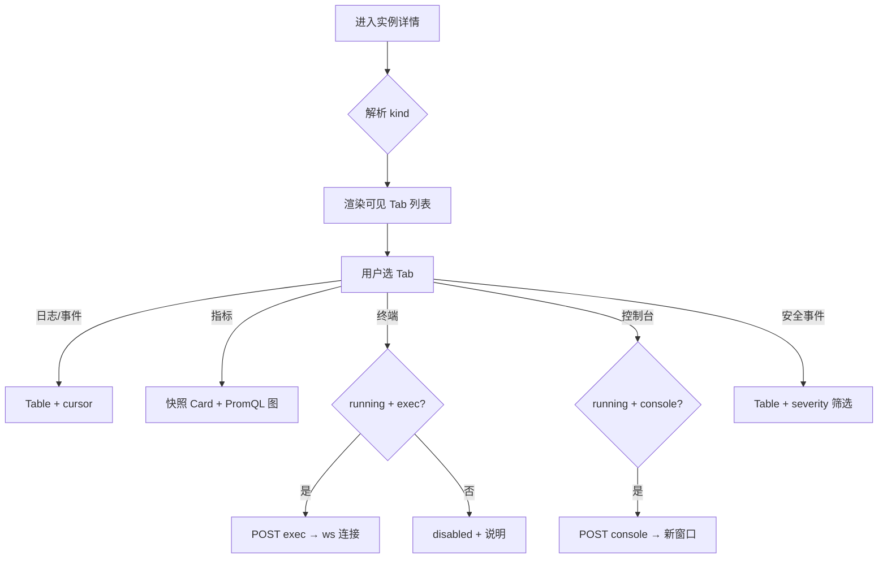

# UX: 统一实例可观测性（Console）

> Interaction specification derived from: `repo/services/tasks/modules/prd/console/compute/prd-console-instance-observability.md`  
> Part of ani-workflow artifact triad — next: `/prd-to-spec`  
> Generated: 2026-07-03 | Product: **Console** | UI stack: **TDesign React + TanStack Router + React Query + ECharts**  
> Module main doc: `repo/services/docs/console-modules/compute/container-observability.md`

**范围：** 实例详情内的可观测性 Tab（日志 / 事件 / 指标 / 终端或控制台 / Sandbox 安全事件）；不含 Core handler、PromQL 模板正文、exec WebSocket 协议（→ SPEC）。

---

## 1. Page Type

### 1.1 Classification

| Screen | Page type | In app shell? | Route |
|--------|-----------|---------------|-------|
| 实例列表 + 详情（宿主） | list + inspector（模板 D） | 是 | `/_authenticated/compute/instances`（列表）；选中行或 `$instanceId` 打开详情 |
| 实例详情 · 可观测性 Tabs | detail fragment（Tab 面板） | 是 | 同上详情路由内 Tab 切换，**无**独立 `/observability` 路由 |

> `[Assumption]` 实例详情路由尚未在 `repo/frontends/console/` 落地；与 `container-instance-management.md` 对齐为 `compute/instances` 资源域。可观测性为详情页 **Tab 组**，不是单独页面。

### 1.2 Pattern Reference

| 参考 | 说明 |
|------|------|
| 页面模板 §7 模板 D | 列表 + 详情检查器；详情内多 Tab |
| `demo-instance-workspace-ui-a` | overview / metrics / events 等 Tab 并列 |
| `inference-observability.md` | 日志 cursor 分页 + PromQL 时序图分层（实例 API 不同） |
| `_authenticated/index.tsx` | `ConsolePage`、Card、Empty、Alert 区块模式 |
| `package.json` | 图表：`echarts` + `echarts-for-react`（规范指定） |

---

## 2. Information Architecture

### 2.1 Routes & Entry Points

| Route | Entry | Auth required |
|-------|-------|---------------|
| `/_authenticated/compute/instances` | 侧栏「实例管理」；列表行点击 | 是 |
| 详情 Tab「日志/事件/…」 | 详情页 Tab 点击；URL 可选 `?tab=logs` | 是 |

**深链：** 支持 `?tab=logs|events|metrics|terminal|console|security-events`；非法 tab 或当前 kind 不可见 tab → 回退到「日志」。

### 2.2 Navigation Relationship

```text
Console 壳
  └── 算力与云资源
        └── 实例管理（列表）
              └── 详情检查器 / $instanceId
                    ├── [概览]          ← 实例主模块（非本文）
                    ├── [日志]          ← 本文
                    ├── [事件]
                    ├── [指标]          ← kind 不支持则 Tab 不存在
                    ├── [终端]          ← container / gpu_container / sandbox
                    ├── [控制台]        ← vm
                    └── [安全事件]      ← sandbox
```

面包屑：`算力与云资源 / 实例管理 / {instance.name}`

### 2.3 PRD Coverage Map

| PRD 项 | UX 区域 |
|--------|---------|
| US-007 | §2.2 Tab 壳层 + §4.1 上下文条 + kind 可见性 |
| US-008 | §4.2 日志 Tab |
| US-009 | §4.3 事件 Tab |
| US-010 | §4.4 指标 · 快照区 |
| US-011 | §4.4 指标 · PromQL 图表区 |
| US-012 | §4.5 终端 Tab |
| US-013 | §4.6 控制台 Tab |
| US-014 | §4.7 安全事件 Tab |
| US-015 | §4.1 kind 矩阵 + §6 差异化状态 |
| FR-6～FR-13 | §5 组件 + §6 状态 |
| US-001～006 | Core only — UX 仅定义消费契约后的 UI 行为 |

---

## 3. User Flow

### 3.1 Primary Flow（观测闭环）

```text
1. 用户在实例列表选中一行 → 右侧详情打开（或跳转 $instanceId）
2. 详情 PageHeader 展示 name、id、state Tag、kind Tag
3. 用户点击「日志」Tab → loading → 展示最近 100 条；可「加载更多」
4. 切换「事件」→ 事件 Table + cursor 分页
5. 若 kind 支持指标：切换「指标」
   a. 快照区并发拉 getInstanceMetrics → Statistic 卡片
   b. 图表区按默认 1h 拉 observability/query（冻结模板）→ ECharts 折线
   c. 用户切换 15m/1h/6h/24h → 图表 refetch
6. 若 kind 支持且 state=running：用户进入「终端」或「控制台」→ 连接 → 会话区展示
7. sandbox 用户查看「安全事件」→ 可选 severity 筛选
```

### 3.2 Secondary Flows

| 流程 | 行为 |
|------|------|
| 实例 deleted | 详情只读或不可进入；观测 Tab 不可用 |
| 无 exec 权限 | 「终端」Tab 可见但内容区 `Alert theme="warning"` + 连接按钮 disabled |
| 无 observability 读权限 | 指标 Tab 快照可用；图表区 `Alert`「无权限查看趋势数据」 |
| PromQL 无数据 | 图表 `Empty`「所选时间范围暂无数据」 |
| 快照字段 null | 对应 `Statistic` 显示「暂不可用」，不显示 0 |
| exec session 过期 | 终端区 Banner「会话已过期」+ 按钮「重新连接」 |
| VM 控制台 | 选 protocol →「打开控制台」→ `window.open(connect_url)` 新窗口 |
| 手动刷新指标 | 快照区「刷新」仅 refetch metrics；图表区随时间范围 refetch |

### 3.3 Flow Diagram



---

## 4. Layout Regions

### 4.0 详情页 · 可观测性公共壳

```text
┌─────────────────────────────────────────────────────────────┐
│ PageHeader: {name}  Tag(state)  Tag(kind)  复制 ID          │
├─────────────────────────────────────────────────────────────┤
│ Tabs: 概览 | 日志 | 事件 | 指标? | 终端? | 控制台? | 安全?   │
├─────────────────────────────────────────────────────────────┤
│ [Active Tab Panel — 见下]                                    │
└─────────────────────────────────────────────────────────────┘
```

| Region | Content | Notes |
|--------|---------|-------|
| PageHeader | `name`、`id`（可复制）、`state`、`kind` | 与 PRD 上下文条一致 |
| Tab bar | kind 过滤后的 Tab 项 | **不渲染** hidden Tab |
| Tab panel | 各 §4.2～4.7 | `Tabs` `placement="top"` |

### 4.1 Kind × Tab 可见性（UX 实现表）

| kind | 日志 | 事件 | 指标 | 终端 | 控制台 | 安全事件 |
|------|------|------|------|------|--------|----------|
| container | ✓ | ✓ | ✓ | ✓ | — | — |
| gpu_container | ✓ | ✓ | ✓ | ✓ | — | — |
| sandbox | ✓ | ✓ | ✓ | ✓ | — | ✓ |
| vm | ✓ | ✓ | ✓ | — | ✓ | — |
| batch_job | ✓ | ✓ | ✓ | — | — | — |
| notebook | ✓ | ✓ | ✓ | — | — | — |
| k8s_cluster | ✓ | ✓ | **无 Tab** | — | — | — |
| bare_metal | ✓ | ✓ | **无 Tab** | — | — | — |
| dpu_node | ✓ | ✓ | **无 Tab** | — | — | — |

配置来源：`INSTANCE_OBSERVABILITY_TAB_CONFIG[kind]`（SPEC 实现）；首期 hardcode 上表。

### 4.2 日志 Tab

```text
┌─────────────────────────────────────────────────────────────┐
│ Toolbar: Select(level 筛选) | Button(刷新)                    │
├─────────────────────────────────────────────────────────────┤
│ Table: timestamp | level Tag | message | container | stream │
│ （message 列 monospace，超长 ellipsis + tooltip）               │
├─────────────────────────────────────────────────────────────┤
│ Footer: Button(加载更多) — 有 next_cursor 时显示              │
└─────────────────────────────────────────────────────────────┘
```

### 4.3 事件 Tab

```text
┌─────────────────────────────────────────────────────────────┐
│ Table: occurred_at | type Tag | reason | message | count    │
├─────────────────────────────────────────────────────────────┤
│ Footer: Button(加载更多)                                      │
└─────────────────────────────────────────────────────────────┘
```

- `type=Warning` → `Tag theme="warning"`；`Normal` → `Tag theme="default"`

### 4.4 指标 Tab（双通道）

```text
┌─────────────────────────────────────────────────────────────┐
│ Row1 工具条: 快照更新时间 | Button(刷新) | Switch(30s自动刷新) │
├─────────────────────────────────────────────────────────────┤
│ Row2 快照: Col×N Statistic 卡片                              │
│   CPU % | 内存 used/total | 网络 RX/TX | [GPU 仅 gpu_container]│
├─────────────────────────────────────────────────────────────┤
│ Row3 图表工具条: Radio.Group(15m|1h|6h|24h)  图表查询时间     │
├─────────────────────────────────────────────────────────────┤
│ Row4 ECharts 折线图（高度 ≥ 280px）                          │
│   系列: CPU利用率、内存使用率；gpu_container + GPU利用率、显存 │
└─────────────────────────────────────────────────────────────┘
```

- 快照区标注：`快照时间：{metrics.timestamp}`
- 图表区标注：`趋势数据查询于 {queriedAt}`（与快照时间可能不同）

### 4.5 终端 Tab（exec）

```text
┌─────────────────────────────────────────────────────────────┐
│ Toolbar: Button theme=primary(连接终端) | Tag(连接状态)        │
├─────────────────────────────────────────────────────────────┤
│ 终端容器（min-height 400px, bg container, monospace）         │
│ idle: Empty「点击连接终端开始会话」                            │
│ connected: 终端输出区（SPEC 定 xterm）                        │
└─────────────────────────────────────────────────────────────┘
```

- 非 `running`：Toolbar 按钮 disabled + `Tooltip`「仅运行中实例可连接」
- 无 exec 权限：整页 `Alert theme="warning" title="无终端权限"`

### 4.6 控制台 Tab（VM）

```text
┌─────────────────────────────────────────────────────────────┐
│ Form inline: Select(protocol) | Button(打开控制台)            │
├─────────────────────────────────────────────────────────────┤
│ Alert theme="info"：将在新窗口打开会话，会话过期后请重新申请    │
└─────────────────────────────────────────────────────────────┘
```

- `Select` 选项：`console` / `vnc` / `serial`（默认 `vnc`）；`novnc` 若 API 支持则列入
- 成功：`window.open(url, '_blank', 'noopener,noreferrer')`

### 4.7 安全事件 Tab（Sandbox）

```text
┌─────────────────────────────────────────────────────────────┐
│ Toolbar: Select(severity: 全部|info|warning|critical)        │
├─────────────────────────────────────────────────────────────┤
│ Table: occurred_at | severity Tag | event_type | description │
└─────────────────────────────────────────────────────────────┘
```

---

## 5. Component Mapping

### 5.1 壳层与导航

| UI 元素 | TDesign / 工程 | Props / variant | 数据 |
|---------|------------------|-----------------|------|
| 详情 Tab 栏 | `Tabs` | `theme="normal"` | kind 过滤后的 tab 列表 |
| 实例状态 | `Tag` | running→success, stopped→default, failed→danger | `instance.state` |
| 实例类型 | `Tag` | variant outline | `instance.kind` |
| 复制 ID | `Button` + `CopyIcon` | `variant="text"` | `instance.id` |

### 5.2 日志 Tab

| UI 元素 | 组件 | 说明 |
|---------|------|------|
| 级别筛选 | `Select` | 选项：全部 / debug / info / warn / error → query `level` |
| 日志表 | `Table` | columns 见 OpenAPI `InstanceLogEntry` |
| 级别列 | `Tag` | error→danger, warn→warning, info→primary, debug→default |
| 加载更多 | `Button` | `variant="outline"`，绑定 `next_cursor` |

### 5.3 事件 Tab

| UI 元素 | 组件 | columns |
|---------|------|---------|
| 事件表 | `Table` | `occurred_at`, `type`, `reason`, `message`, `count` |

### 5.4 指标 Tab

| UI 元素 | 组件 | 说明 |
|---------|------|------|
| 快照卡片 | `Row` + `Col` + `Card` + 自定义 `Statistic` 或 `Statistic` | 字段映射见 `InstanceMetrics` |
| GPU 卡片 | 同上 | 仅 `kind=gpu_container` 渲染第二行 |
| null 值 | `Statistic` 或文本 | 固定 copy「暂不可用」 |
| 自动刷新 | `Switch` | label「30 秒自动刷新」；默认开 |
| 时间范围 | `Radio.Group` | `variant="default-filled"`；选项 15m/1h/6h/24h |
| 趋势图 | `ReactECharts` | line；色板用 TDesign token / 规范图表色 |

### 5.5 终端 / 控制台

| UI 元素 | 组件 | 说明 |
|---------|------|------|
| 连接终端 | `Button` | `theme="primary"`，`loading`  durante POST exec |
| 连接状态 | `Tag` | 未连接 / 连接中 / 已连接 / 已过期 |
| 协议选择 | `Select` | VM console Tab |
| 打开控制台 | `Button` | `theme="primary"` |

### 5.6 安全事件 Tab

| UI 元素 | 组件 | 说明 |
|---------|------|------|
| severity 筛选 | `Select` | 映射 query `severity` |
| 事件表 | `Table` | `InstanceSecurityEvent` 字段 |
| severity 列 | `Tag` | critical→danger, warning→warning, info→primary |

---

## 6. State Design

### 6.1 日志 Tab

| State | Trigger | UI behavior |
|-------|---------|-------------|
| loading | 首次 / 刷新 | `Table loading` |
| idle | 200 + items | 展示表格 |
| empty | items=[] | `Empty description="暂无日志"` |
| error | 4xx/5xx | `Alert theme="error"` + API message + `request_id` + `Button(重试)` |
| loading-more | 点击加载更多 | 底部 Button loading；append rows |
| end | 无 next_cursor | 隐藏「加载更多」 |

### 6.2 事件 Tab

同 §6.1 模式；empty copy：「暂无事件」。

### 6.3 指标 Tab

| State | Trigger | UI behavior |
|-------|---------|-------------|
| snapshot-loading | getInstanceMetrics | 卡片区 `Skeleton` 或 `Loading` |
| snapshot-idle | 200 | 展示 Statistic；null 字段「暂不可用」 |
| snapshot-error | metrics 失败 | 卡片区 `Alert` + 重试；**不**阻塞图表区 |
| chart-loading | PromQL fetch | 图表区 `Loading` |
| chart-idle | 有 series | ECharts 渲染 |
| chart-empty | 无 series | `Empty`「所选时间范围暂无数据」 |
| chart-error | 403 | `Alert`「无权限查看趋势数据」 |
| chart-error | 其他 | `Alert` + 重试 |
| auto-refresh | Switch on | 每 30s refetch 快照；图表随当前 range refetch |

### 6.4 终端 Tab

| State | Trigger | UI behavior |
|-------|---------|-------------|
| disabled-not-running | state≠running | 连接按钮 disabled + Tooltip |
| disabled-no-permission | 无 exec scope | `Alert theme="warning"` |
| idle | 未连接 | Empty + 连接按钮 enabled |
| connecting | POST exec 中 | Button loading |
| connected | ws open | Tag success + 终端区 active |
| expired | now > expires_at | Banner warning + 重新连接 |
| error | exec 4xx/422 | `Message.error` + 保留 idle |

### 6.5 控制台 Tab

| State | Trigger | UI behavior |
|-------|---------|-------------|
| disabled-not-running | state≠running | 打开按钮 disabled |
| disabled-no-permission | 无 console scope | `Alert theme="warning"` |
| idle | 就绪 | Form 可提交 |
| opening | POST console | Button loading |
| opened | 200 | 新窗口 + `Message.success`「已打开控制台」 |
| error | 4xx | `Message.error` |

### 6.6 安全事件 Tab

| State | Trigger | UI behavior |
|-------|---------|-------------|
| loading / idle / empty / error | 同 Table 标准 | empty：「暂无安全事件」 |

### 6.7 全局边缘态

| State | Trigger | UI behavior |
|-------|---------|-------------|
| 401 | 任意 API | 全局 auth 重定向（现有 Console 行为） |
| deleted 实例 | state=deleted | 不展示观测 Tab 或整页 `Empty`「实例已删除」 |

---

## 7. Copy & Feedback

### 7.1 Labels & Tabs

| 元素 | Copy (zh-CN) |
|------|----------------|
| Tab 日志 | 日志 |
| Tab 事件 | 事件 |
| Tab 指标 | 指标 |
| Tab 终端 | 终端 |
| Tab 控制台 | 控制台 |
| Tab 安全事件 | 安全事件 |
| 加载更多 | 加载更多 |
| 刷新（快照） | 刷新 |
| 连接终端 | 连接终端 |
| 重新连接 | 重新连接 |
| 打开控制台 | 打开控制台 |
| 自动刷新 | 30 秒自动刷新 |

### 7.2 Messages

| 场景 | 类型 | Copy |
|------|------|------|
| 指标快照失败 | `Alert` error | 无法加载指标快照，请稍后重试 |
| 趋势无权限 | `Alert` warning | 无权限查看趋势数据 |
| 趋势无数据 | `Empty` | 所选时间范围暂无数据 |
| 字段不可用 | 卡片内文本 | 暂不可用 |
| exec 非 running | `Tooltip` | 仅运行中的实例可连接终端 |
| exec 无权限 | `Alert` warning | 当前账号无终端访问权限 |
| 会话过期 | `Alert` warning | 终端会话已过期，请重新连接 |
| 控制台已打开 | `Message.success` | 已在新窗口打开控制台 |
| API 失败（含 request_id） | `Alert` error | {message}（请求 ID：{request_id}） |

---

## 8. Boundaries & Non-Goals

### 8.1 In Scope (UX)

- 实例详情内 kind 感知的 Tab 与布局
- 日志/事件 cursor 分页交互
- 指标双通道 UI（快照 + PromQL 图表）
- exec / VM console 连接入口与 disabled 规则
- Sandbox 安全事件列表与 severity 筛选
- loading / empty / error / partial-null 全状态

### 8.2 Explicitly Out of Scope (UI)

- 不展示 Prometheus 地址、原始 PromQL 输入框（模板由 SPEC 注入）
- 无实例级 Dashboard 页
- `batch_job`、`notebook` **无**终端 Tab
- `k8s_cluster`、`bare_metal`、`dpu_node` **无**指标 Tab（非空态隐藏）
- 无日志导出、无告警规则配置 UI
- 无 K8s 工作负载级观测 UI
- 不在本 UX 定义 xterm/WebSocket 帧格式（→ SPEC）

### 8.3 Open UX Questions

- 无（PRD §9 产品决策已关闭；剩余实现细节归 SPEC）

### 8.4 Assumptions

- 可观测性嵌入实例详情 **Template D** 检查器，不单独占侧栏菜单项
- 实例列表/概览 Tab 由实例管理 SPEC 实现；本文仅定义观测 Tab 面板
- PromQL 由前端 **常量模块**引用 SPEC 冻结模板 ID，运行时注入 `instance_id`（不在 UX 写具体 PromQL 字符串）
- 图表使用已有依赖 `echarts-for-react`
- 日志 `message` 列不做 ANSI 彩色解析（首期纯文本）；后续可扩展
- URL `?tab=` 深链为可选增强，SPEC 可 Phase 1 仅用本地 Tab state

---

## 9. Browser Verification Checklist（对齐 PRD AC）

| 场景 | kind | 验证点 |
|------|------|--------|
| Tab 差异 | container | 有终端；无控制台、无安全事件 |
| Tab 差异 | vm | 有控制台；无终端 |
| Tab 差异 | sandbox | 有终端 + 安全事件 |
| Tab 差异 | batch_job | 无终端 |
| Tab 差异 | k8s_cluster | 无指标 Tab |
| 日志 empty | any | Empty 非 error |
| 指标 partial null | gpu_container | GPU 卡片「暂不可用」 |
| 指标 chart empty | container | PromQL 无数据 Empty |
| 终端 disabled | container stopped | 按钮 disabled |
| exec 403 | container | Alert 无权限 |
